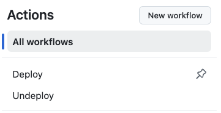
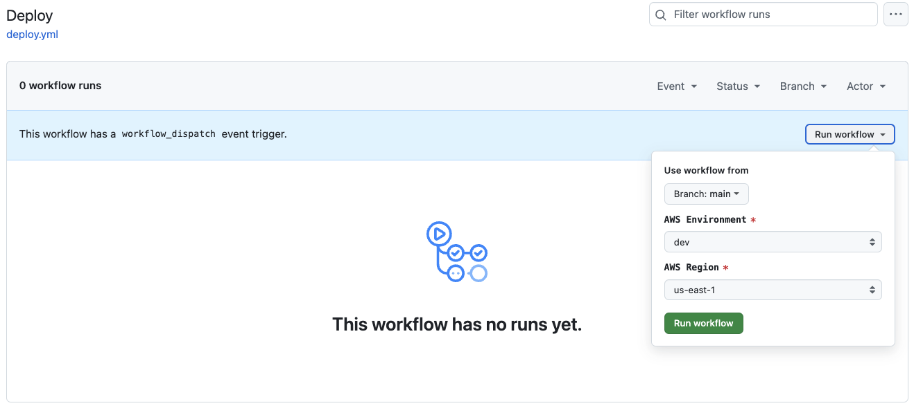

# IaC Snowflake User RSA Key Pairs Generator
This AWS Lambda function, developed in Python, automates the generation of two new [RSA key pairs](https://github.com/j3-signalroom/j3-techstack-lexicon/blob/main/cryptographic-glossary.md#rsa-key-pair), which are essential for enabling secure, public-key authentication for a Snowflake service account user. Given Snowflake's current limitation of allowing a maximum of two RSA key pairs per user, this function supports key-pair rotation to maintain security and compliance standards. Once the RSA key pairs are generated, the function securely stores them in AWS Secrets Manager, leveraging encryption and fine-grained access controls to protect the keys from unauthorized access. This process not only facilitates seamless retrieval and management of the RSA key pairs for future authentication use by the Snowflake service account user but also ensures that the keys are handled in accordance with best practices for cloud security and data protection.

**Table of Contents**

<!-- toc -->
+ [1.0 Let's get started!](#10-lets-get-started)
+ [2.0 Resources](#20-resources)
<!-- tocstop -->

## 1.0 Let's get started!
1. Take care of the cloud and local environment prequisities listed below:
    > You need to have the following cloud accounts:
    > - [AWS Account](https://signin.aws.amazon.com/) *with SSO configured*
    > - [`aws2-wrap` utility](https://pypi.org/project/aws2-wrap/#description)

    > You need to have the following installed on your local machine:
    > - [AWS CLI version 2](https://docs.aws.amazon.com/cli/latest/userguide/getting-started-install.html)

2. Clone the repo:
    ```bash
    git clone https://github.com/j3-signalroom/iac-snowflake-user-rsa_key_pairs_generator-lambda.git
    ```

3. **Navigate to the Root Directory**: Open your Terminal and navigate to the root folder of the `iac-snowflake-user-rsa_key_pairs_generator-lambda/` repository that you have cloned. You can do this by executing:

   ```bash
   cd path/to/iac-snowflake-user-rsa_key_pairs_generator-lambda/
   ```

   Replace `path/to/` with the actual path where your repository is located.

4. **Run the Script to Create or Delete the ECR Repository:**  Execute the `deploy-locally.sh` script to create an AWS Elastic Container Registry (ECR) repository, build the AWS Lambda Docker container, and publish it to the newly created ECR repository. This will make the container image available for future deployments.

    Use the following command format:

    ```bash
    ./deploy-locally.sh <create | delete> --profile=<SSO_PROFILE_NAME>
    ```

5. **Replace Argument Placeholders:**
   - `<create | delete>`: Specify either `create` to create the ECR repository or `delete` to remove it.
   - `<SSO_PROFILE_NAME>`: Replace this with your AWS Single Sign-On (SSO) profile name, which identifies your hosted AWS infrastructure.

    For example, to create the ECR repository, use the following command:
    ```bash
    ./deploy-locally.sh create --profile=my-aws-sso-profile
    ```
    Replace `my-aws-sso-profile` with your actual AWS SSO profile name.

6. Or, to run the similiar script from GitHub, follow these steps:

    a. Deploy the Repository: Ensure that you have cloned or forked the repository to your GitHub account.

    b. Set Required Secrets and Variables: Before running any of the GitHub workflows provided in the repository, you must define at least the `AWS_DEV_ACCOUNT_ID` variable (which should contain your AWS Account ID for your development environment). To do this:

    - Go to the Settings of your cloned or forked repository in GitHub.

    - Navigate to **Secrets and Variables > Actions**.

    - Add the `AWS_DEV_ACCOUNT_ID` and any other required variables or secrets.

    c. Navigate to the **Actions Page**:

    - From the cloned or forked repository on GitHub, click on the **Actions tab**.

    d. **Select and Run the Deploy Workflow**:

    - Find the **Deploy** workflow link on the left side of the **Actions** page and click on it.

        

    - On the **Deploy** workflow page, click the **Run workflow** button.

    - A workflow dialog box will appear. Fill in the necessary details and click **Run workflow** to initiate the building and publishing the Lambda docker container to ECR.

        

## 2.0 Resources
- [RSA API](https://cryptography.io/en/latest/hazmat/primitives/asymmetric/rsa/)

By following these steps, you will set up the necessary infrastructure to build and deploy the Lambda function container for secure RSA key pair generation in Snowflake.
